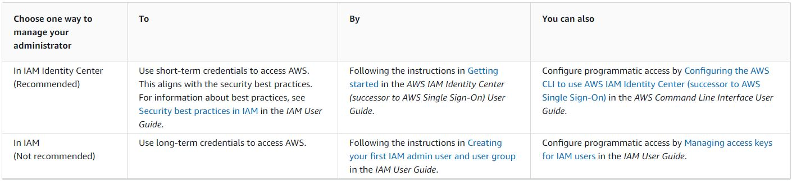
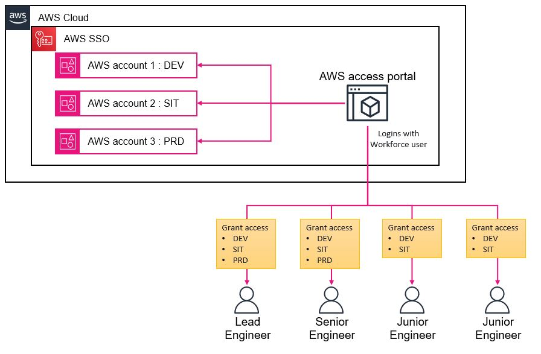

# aws-sdk-temporary-credentials
## Introduction
When I get started with AWS, the majority of the tutorials that I find are going to focus on creating and managing AWS services via the console. However, actually, AWS Service provides another two ways: the **AWS Command Line Interface (AWS CLI)** and **Software Development Kits (SDKs)**
that you can access to manage AWS Service. \
I tried to conduct it that way, but it's not as easy as the console. There are many prerequisites that you need to meet in advance. From my experience, I spent a whole day getting to understand the concept and being able to build a SDK to connect to an AWS service. \
So on this POC project, I would like to note everything based on my understanding, and I hope it will help other people who are new to AWS and might not waste their time like me.  

## Accessing AWS Services
At I mentioned above there are 3 way that you can access and manage Amazon Web Services.
> AWS Management Console\
  AWS Command Line Interface (AWS CLI)\
  Software Development Kits (SDKs)

However, On this article I'm going to focus only CLI and SDK.\
Refer : https://docs.aws.amazon.com/whitepapers/latest/aws-overview/accessing-aws-services.html

## Credentials concept
One thing that you need to understand before using the AWS CLI is the concept of credentials. Basically, when you access AWS via console, you have to provide a username and password to identify that you're an owner account, and then you can manage the service. On the CLI and SDK, you need to identify as well. But instead of using the username and password, the CLI and SDK use credentials to authenticate and get authority.

**2 Type of Credentials**
>**Long-term credentials** : permanent access keys associated with individual IAM users.

>**Short-term credentials** : dynamically generated access keys designed to enhance security by limiting the exposure of sensitive credentials.

You may be curious about which option to choose for implementation. This is an important consideration as both options have distinct requirements in their configuration. Consequently, making the wrong choice could result in a significant amount of time being spent on redoing the necessary setup. 

It's worth noting that AWS documentation actually suggests opting for short-term credentials, as this approach is in line with established security best practices.
For further information, I would like to suggest taking a look at the illustration and document below.

Refer : https://docs.aws.amazon.com/whitepapers/latest/aws-overview/accessing-aws-services.html

## From a Single Account to a Multi-Account
When an organization decided to move to developing software based on cloud services. In the beginning, they might use just a few services, and this is okay because we just need one account for managing all of them.\
However, since the organization continues to use AWS Cloud, They develop many projects in parallel on the AWS Cloud. There are many departments involved in the projects, and many people have access to the AWS Cloud. According to this scenario, if you still use one account, it's really difficult to manage and control things like security, cost, and scalability.

Consequently, AWS offers a recommended solution to address this challenge known as the **"landing zone"** concept. A landing zone entails a multi-account framework that assists in designing a multi-account environment. For more comprehensive details, please refer to the following link: https://docs.aws.amazon.com/prescriptive-guidance/latest/migration-aws-environment/understanding-landing-zones.html

## One problem is solved, but it leads to another problem.
Employing multiple accounts constitutes a recommended approach. Nevertheless, this approach introduces novel complexities.\
Consider that your organization is developing a shopping application on AWS Cloud with 3 development environments: DEV, SIT, and PRD.\
In order to align with the landing zone concept, the organization is going to assign one account per environment.\
And let's say in this project, there are 4 people in different roles, that they granted permission to access the development environment in the following way:

| Roles       		      | Access to environments area|
|-----------------------|--------------------------|
| Lead Engineer         | DEV, SIT and PRD         |
| Senior Engineer       | DEV, SIT and PRD         |
| Junior Engineer 1   	| DEV, SIT 			           |
| Junior Engineer 2   	| DEV, SIT        	       |

Based on the scenario provided, if you are a Lead Engineer of this project that mean you havae to handling 3 accounts for access to in each environment.\
This can pose challenges in effectively overseeing resources, services, billing, and may even expose potential security risks.
>As a response to this, AWS offers the AWS IAM Identity Center (the successor to AWS Single Sign-On) to simplify the centralization and management of multiple accounts.

## AWS IAM Identity Center (successor to AWS Single Sign-On)
As previously stated, the IAM Identity Center has the capability to centrally oversee access across various AWS accounts and applications. You simply need to recall a single username and password, granting you access to all accounts for which you possess authorization.\
To enhance comprehension, please refer to the illustration provided below.

Imagine you hold the role of a lead engineer. Through the utilization of AWS SSO, the requirement to recall distinct usernames and passwords for various environments becomes unnecessary.\
Instead, you have the option to enroll a workforce user in the IAM Identity Center. Subsequently, you can establish a connection between this workforce user and your AWS accounts.

Regarding the procedure of gaining entry into AWS accounts, the steps are quite straightforward.\
You simply navigate to the AWS access portal and authenticate using the designated workforce user credentials.\
Subsequently, a comprehensive roster of accessible AWS accounts will be presented for your perusal.
